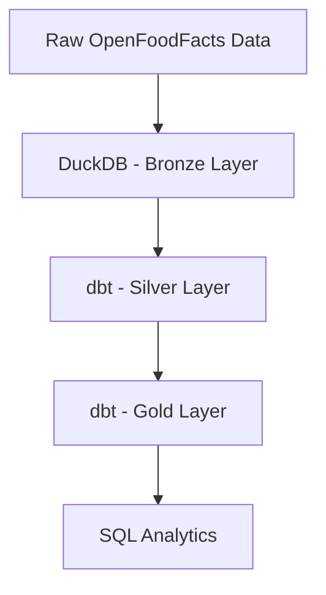
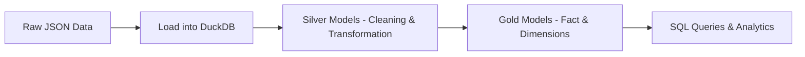

# openfoodfacts-data-pipeline

An end-to-end data engineering project that builds a full pipeline from raw food data to analytical insights using DuckDB and dbt.

---

## Overview

This project focuses on transforming raw OpenFoodFacts data into a structured analytical model that can be used for querying and insights.

The pipeline follows a layered architecture:

* Raw data ingestion
* Data cleaning and transformation
* Analytical modeling
* Querying for insights

---

## Project Goals

* Build a complete ELT pipeline
* Work with messy real-world data
* Design an OLAP-style schema
* Perform analytical queries
* Understand how dbt works in practice

---

## Architecture



---

## Data Pipeline Flow



---

## Data Layers

### Bronze Layer

* Raw dataset loaded into DuckDB
* No transformations applied

---

### Silver Layer

Handles data cleaning and preparation:

* Removing empty values
* Standardizing fields
* Handling missing values
* Flattening JSON fields (nutriments)

Models:

* silver_products
* silver_nutriments

---

### Gold Layer

Analytical layer designed for querying:

* fact_products → main fact table with metrics
* dim_ingredients → ingredient-level analysis

This layer is optimized for analytical queries and BI tools.

---

## Features

* End-to-end data pipeline
* JSON data flattening
* Data cleaning and standardization
* Star schema modeling
* Analytical SQL queries

---

## Example Queries

```sql
-- Top brands by product count
SELECT brands, COUNT(*) AS product_count
FROM gold.fact_products
GROUP BY brands
ORDER BY product_count DESC
LIMIT 10;
```

```sql
-- Products with highest sugar
SELECT code, sugars_g
FROM gold.fact_products
ORDER BY sugars_g DESC
LIMIT 10;
```

```sql
-- Average energy per category
SELECT compared_to_category, AVG(energy_kcal)
FROM gold.fact_products
GROUP BY compared_to_category;
```

---

## Tech Stack

* Python
* DuckDB
* dbt
* SQL

---

## How to Run

```bash
source venv/bin/activate
dbt run
```

Then open DuckDB and execute queries from the sql folder.

---

## Future Improvements

* Add dbt tests for data validation
* Improve ingestion using dlt
* Build a dashboard for visualization
* Optimize transformations

---

## Author

Sara Nour

---

## Notes

This project is part of my journey in learning Data Engineering and building real-world pipelines step by step.

